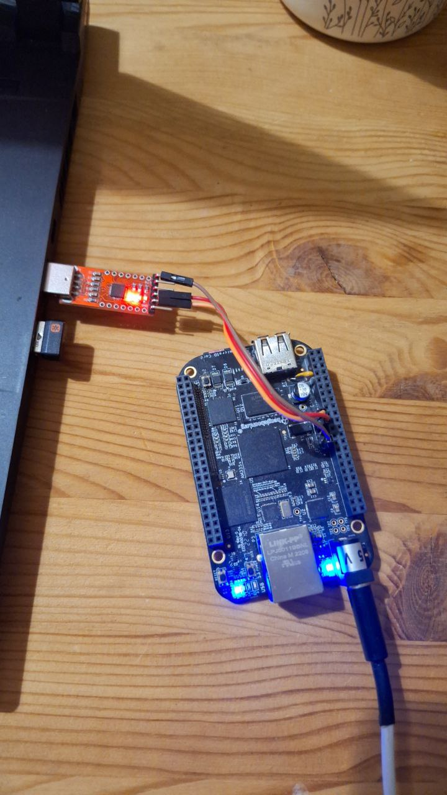
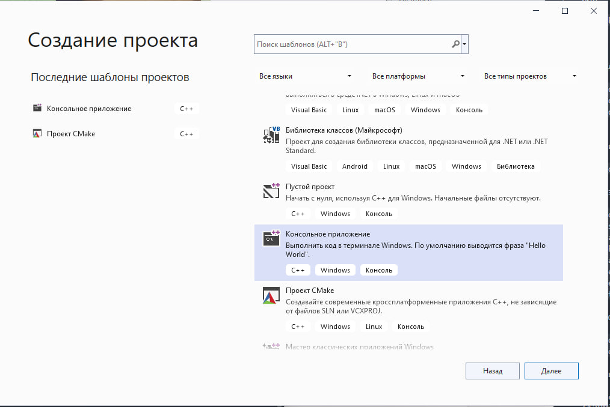
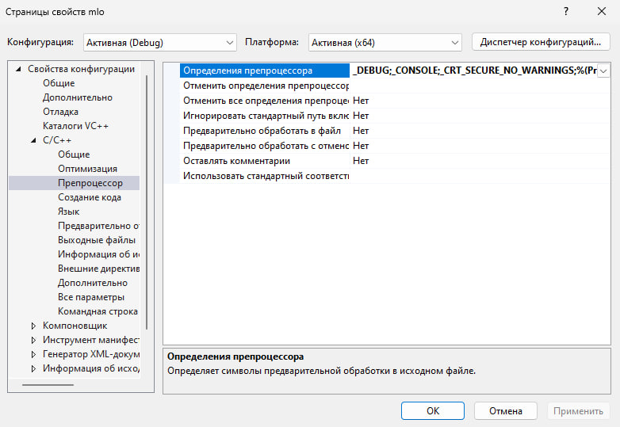
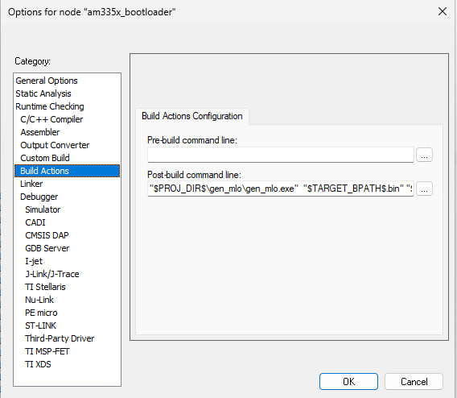

# AM335x baremetal SPL

This is C++ secondary bootloader project for the **beaglebone black rev. C** board for barematal applications.
It eventually generates a secondary bootloader (MLO file) which should be placed on the SD card. It initializes the D2516EC4BXGGB(look on the board) DDR3L to further load the baremetal application via JLINK or TIXDSv2 debugger. Therefore, no more .gel or .mac files is needed.
This project succesfully tested on IAR EW for ARM 9.20.1. On other versions not testing.

## Using
Format BOOT sector of SD-card trough standart windows explorer context menu with default 512byte size of sector.
Connect usb-ttl converter to UART0, start the terminal you are comfortable with, press reset and power up the beaglebone black.
After few seconds, if initialization is successful, the bootloader will output the following lines to UART0 on the board:
> bootloader started  
> UART initialized   
> 0x01234567  
> 0x89ABCDEF    
> DDR3L initialized  
> DDR3L read/write check passed

and light up user led 0, user led 3 will blink periodically forever.

That's it, you can load any application via debugger directly into ddr and debug it.



## SPL file generation in Windows
To generate the image of the secondary bootloader it is necessary to compile file in folder **gen_mlo** into an executable program. In this example this is done using **MSVC** and **Visual Studio**, but you can do it in a linux environment using **gcc**.
1. open **Visual Studio** and create simple *console application c++ solution*:

2. copy and paste this **/gen_mlo/gen_mlo.c** code to replace the one generated by **VS**:
```
#include <stdint.h>
#include <stdio.h>
#include <stdlib.h>

int main(int argc, char** argv)
{

  if (argc != 3) {
    printf("argument of binary executable and destination required\n");
    printf("usage: ./gen_mlo <input.bin> <output.img>\n");
    return 0;
  }

  FILE* fin;
  fin = fopen(argv[1], "rb");
  fseek(fin, 0L, SEEK_END);
  int image_size = ftell(fin);
  printf("provided image size in bytes: %d\n", image_size);
  fseek(fin, 0, SEEK_SET);

  FILE* fout;
  fout = fopen(argv[2], "wb"); 
 
  fwrite(&image_size, 4, 1, fout);
 
  uint32_t sram_start = 0x402f0400;
  fwrite(&sram_start, 4, 1, fout);

  uint8_t* image = (uint8_t*)malloc(image_size);
  fread(image, image_size, 1, fin);
  fwrite(image, image_size, 1, fout);

  fclose(fout);
  fclose(fin);

  return 0;
}
```
3. To avoid safety warnings about fopen function
   go to **project settings->C/C++->preprocessor** in field *preprocessor definitions*
   add:
```
   _CRT_SECURE_NO_WARNINGS;
```
  

4. Build poject.  
5. To use standalone generation from cmd put compiled binary am335x_bootloader.bin from output IAR folder
   to folder where gen_mlo.exe is and run from cmd:
```
.\gen_mlo.exe am335x_bootloader.bin MLO
```
6. To use the resulting gen_mlo.exe in IAR postbuild actions go to 
 **project settings->Build Actions**. Add in field Post-build command line:
 ```
 "$PROJ_DIR$\gen_mlo\gen_mlo.exe"  "$TARGET_BPATH$.bin" "$TARGET_DIR$\MLO"
 ```


> **WARNING**  
> For normal operation of the secondary bootloader it is necessary to format   
> section (usually 128M) of SD card in FAT32 file system with sector size 512 in windows explorer   
> and place MLO file on it.   
> It is also very important that **SYSTEMSTART** section and **Entry** symbol in it is located at    
> address **0x402f0400**. To do this you need to write in the **.icf** file: 
```
place at address mem:__ICFEDIT_region_RAM_start__
                      { readonly section SYSTEMSTART }; 
``` 
> and check **.map** file after compilation:
```
...
CSTACK$$Limit           0x402f'4010          --   Gb  - Linker created -
Entry                   0x402f'0400         Code  Gb  init.o [5]
FIQHandler              0x402f'2748         Code  Gb  exceptionhandler.o [5]
...

```
 

    
