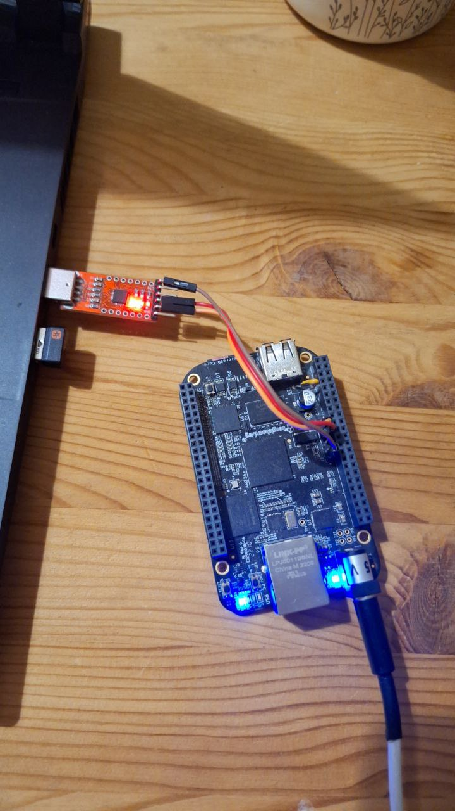

# AM335x baremetal SPL

This is C++ secondary bootloader project for the **beaglebone black rev. C** board for barematal applications.
It eventually generates a secondary bootloader (MLO file) which should be placed on the SD card. It initializes  
the D2516EC4BXGGB(look on the board) DDR3L to further load the baremetal application via JLINK debugger. Therefore, no more .gel or .mac files is needed.
This project succesfully tested on CMake with GCC with Segger ozone(v3.38) and Jlink(v.7.88n).

## Recommended: CMake + GCC (Linux, macOS, WSL)
   This method automatically generates the MLO file for you.  
    Prerequisites:   
- arm-none-eabi-gcc (14.3.rel1 or later)
- cmake (3.24 or later)
- ninja or make

Build Steps:
```bash 
# Clone the repository
git clone https://github.com/iiievan/am335x_bootloader.git
cd am335x_bootloader

# Configure and build for Release (produces MLO)
cmake -B cmake-build-release -DCMAKE_BUILD_TYPE=Release
cmake --build cmake-build-release

# The output MLO file will be in cmake-build-release/
```

##  Preparing the SD Card (Linux)
Use the provided script in to create the required partition layout automatically.
```bash 
cd /am335x_bsp/tools
chmod +x prepare_sd_card.sh
sudo ./prepare_sd_card.sh
```
The script will:  
- Create a 128 MB FAT32 partition (type b) with 512-byte sectors.  
- Create a second ext4 partition for the rootfs (optional).
- Offer to copy the MLO file to the boot partition.

Then connect usb-ttl converter to UART0 on BeagleBone, start the terminal you are comfortable with, press reset(hold it) and power up the beaglebone black.
After few seconds, if initialization is successful, the bootloader will output the following lines to UART0 on the board:
> bootloader started...   
> UART initialized...  
> DDR initialization successful!" 

and light up user leds.

That's it, you can load any application via debugger directly into ddr and debug it.




> **WARNING**  
> For normal operation of the secondary bootloader it is necessary to format   
> section (usually 128M) of SD card in FAT32 file system with sector size 512 and place MLO file on it.   
> It is also very important that **startup** section and **Entry** symbol in it is located at    
> address **0x402f0400**. To do this you need check **.map** file after compilation:
```
.text.startup   0x402f0400      0x140
 *(.text.startup)
 .text.startup  0x402f0400      0x140 am335x_bsp/libam335x_bsp.a(startup.s.obj)
                0x402f0400                Entry

.text           0x402f0540     0x76e4

```
 

    
